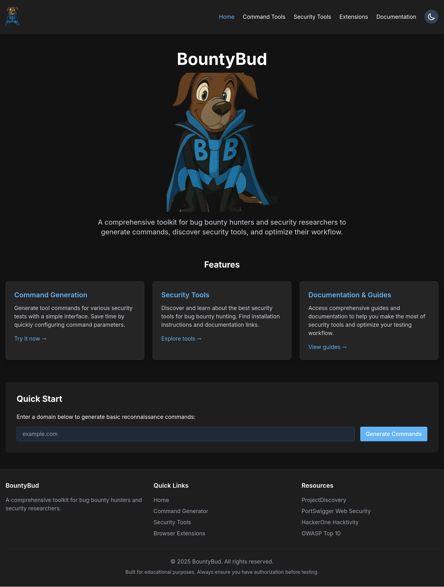

# BountyBud

BountyBud is a comprehensive toolkit for bug bounty hunters and security researchers designed to streamline the workflow of security testing. The platform generates optimized command-line commands, provides a curated collection of security tools, and offers resources to enhance your bug hunting workflow.



## Features

- **Quick Start Domain Reconnaissance**: Enter a domain on the homepage to instantly generate basic reconnaissance commands
- **Command Generation Tool**: Configure and generate complex command-line commands for various security testing scenarios
- **Command History**: Save and reuse previously generated commands
- **Command Chaining**: Create scripts by combining multiple commands in sequence
- **Security Tools Database**: Browse curated list of security tools with installation instructions and documentation links
- **Browser Extensions Collection**: Discover essential browser extensions for bug bounty hunting, filtered by category and browser compatibility
- **Comprehensive Security Guides**: Access in-depth guides on bug bounty workflow, web application hacking methodology, and OWASP Top 10
- **Security Tool Cheatsheets**: Quick reference guides for popular cybersecurity tools with command syntax and usage examples
- **Service Enumeration Tools**: Tools for enumerating services like SMB, LDAP, DNS, SMTP, and more
- **Modern UI**: Dark-themed interface designed specifically for security professionals

## Installation

```bash
# Clone the repository
git clone https://github.com/yourusername/BountyBud.git
cd BountyBud

# Install dependencies
npm install

# Run the development server
npm run dev
```

Open [http://localhost:3000](http://localhost:3000) in your browser to see the application.

## Usage

1. **Quick Start**: Enter a domain on the homepage to generate basic reconnaissance commands
2. **Command Generation**: 
   - Navigate to the Command Generator tool
   - Select a command category and specific command
   - Configure parameters as needed
   - Generate and copy the command for use in your terminal
3. **Command Chaining**:
   - Generate multiple commands
   - Add them to your command chain
   - Export as a bash script for batch execution
4. **Security Tools**: Browse the security tools section to discover new tools for your arsenal
5. **Browser Extensions**: Explore recommended browser extensions to enhance your testing capabilities
6. **Security Guides**:
   - Access comprehensive guides on bug bounty hunting
   - Learn structured web application hacking methodology
   - Study detailed explanations of OWASP Top 10 vulnerabilities
7. **Tool Cheatsheets**:
   - Reference quick command syntax for common security tools
   - Find examples for advanced usage scenarios

## Project Structure

```
/app                     # Next.js App Router
  /page.tsx              # Home page with Quick Start functionality
  /layout.tsx            # Root layout
  /tools                 # Command generation tool
  /security-tools        # Security tools section
  /browser-extensions    # Browser extensions section
  /docs                  # Documentation and guides
  /data                  # Data files for commands, tools, and extensions
/components              # Reusable UI components
/public                  # Static assets
```

## Technologies

- [Next.js](https://nextjs.org/) - React framework for production
- [React](https://reactjs.org/) - UI library
- [TypeScript](https://www.typescriptlang.org/) - Static typing
- [Tailwind CSS](https://tailwindcss.com/) - Utility-first CSS framework

## Recent Enhancements

- Added service enumeration tools (smbmap, enum4linux, dnsrecon, etc.)
- Created comprehensive bug bounty workflow guide
- Added web application hacking methodology guide
- Created in-depth OWASP Top 10 reference
- Added security tools cheatsheets with command syntax and examples

## Contribution

Contributions are welcome! Please feel free to submit a Pull Request.

1. Fork the repository
2. Create your feature branch (`git checkout -b feature/amazing-feature`)
3. Commit your changes (`git commit -m 'Add some amazing feature'`)
4. Push to the branch (`git push origin feature/amazing-feature`)
5. Open a Pull Request

## License

MIT 